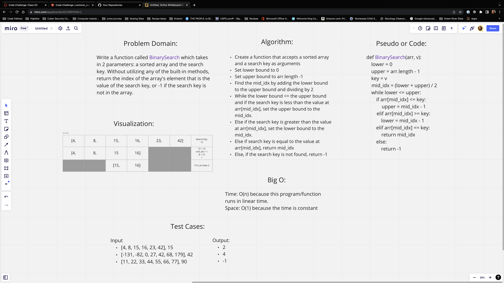

# Binary Search

Write a function called BinarySearch that takes a sorted array and a search key and returns the index at which the number matches the search key. If unable to find the search key, the function will return -1. Do not use any built-in methods.

## Whiteboard Process

### Approach & Efficiency

I set the lower boundary to 0 and the upper boundary to the length of the array -1. I then added the lower boundary + upper boundary and divided that number by 2 to find the midpoint. Then, a check for the value at that index == search key. If not, then if the search key was lower, I set a new upper boundary to the midpoint index and recalculate the length and divide by 2 to get a new midpoint. A check is done again until the search key is found or the sorted array has been searched and there are no values == to the search key and returns a -1. A binary search is rather efficient since you are cutting the search field in half each iteration.
