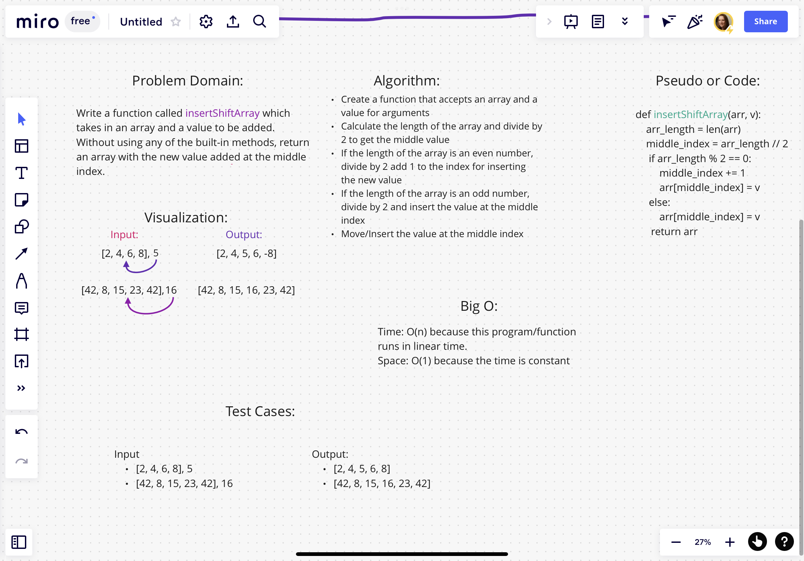

# Reverse an Array

The task was given to write a function that took an array and a value as arguments. Without utilizing any of the built-in methods, return the array with the value inserted at the middle index.

## Whiteboard Process

### Approach & Efficiency

I chose to approach this by starting off calculating the length of the array that the value is to be inserted into. After that, I did floor division by 2. If the length of the array is an even value then, we will add 1 to the calculated middle index and insert the number there by assigning it to the indexed position of the array. If the length of the array is an odd value then, after the floor division, you simply assign the indexed position with the new value.
