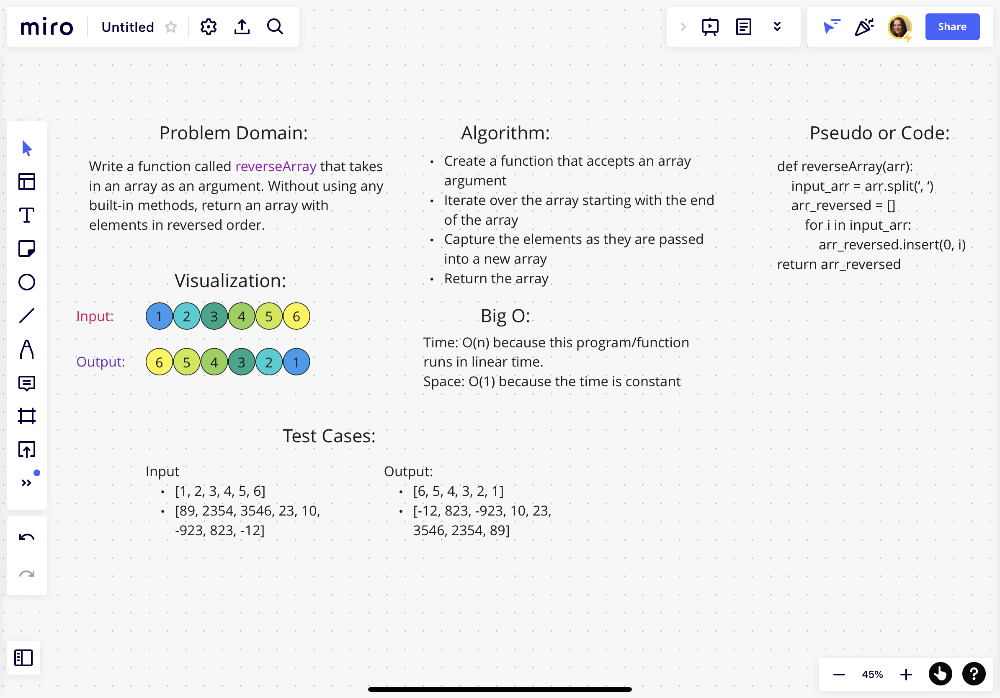

# Reverse an Array

The task was given to write a function that took an array as an argument. Without utilizing any of the built-in methods, return an array with the elements in reverse order

## Whiteboard Process

### Approach & Efficiency

I chose to approach this by splitting the array into its individual elements and then, move the elements 1 at a time inserting them in the 0 position of the new array. As each new element is inserted at the 0 position this moves any other elements towards the last position of the new array.
