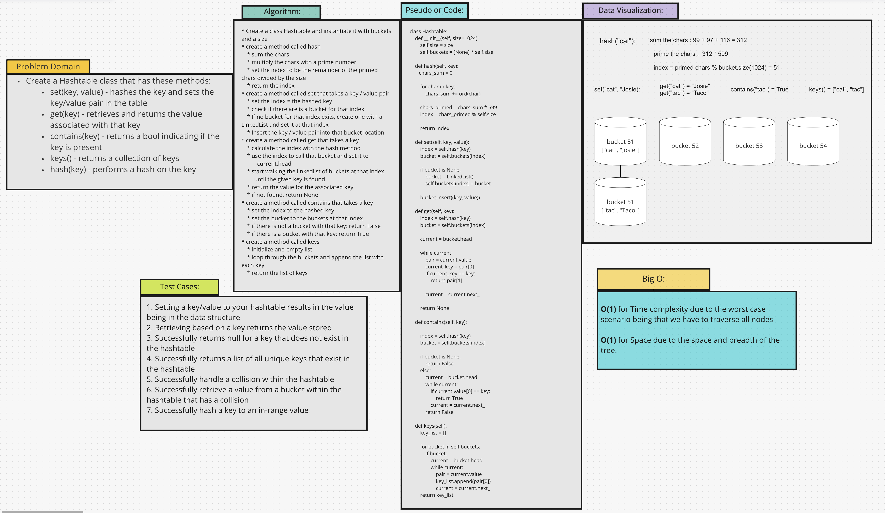

# Hashtables
Hashtables are a data structure that utilizes key / value pairs. The basic concept is that hashtables gives the
ability to store the key with the value so that the value can be quickly retrieved.

## Challenge
To implement a Hashtable class with the methods: set(), get(), contains(), keys(), and hash().

## Approach & Efficiency
BigO for this class:
* `set()`: O(1)
* `get()`: O(1)
* `contains()`: O(1)
* `keys()`: O(1)
* `hash()`: O(1) 
This is because of the nature of the key / value pair being that the key will always be hashed to the same place.

## API
[Code](/data_structures/hashtable.py)
* `set(key, value)`: This method takes in a key and a value, hashes the key and sets the key / value pair in the table.
* `get(key)`: This method takes in the key and returns the value associated with it.
* `contains(key)`: This method takes in a key and returns a boolean value indicating if the key exists.
* `keys()` This method returns a collection of keys.
* `hash(key)`: This method takes in a key and hashes it to create the index for that value.

