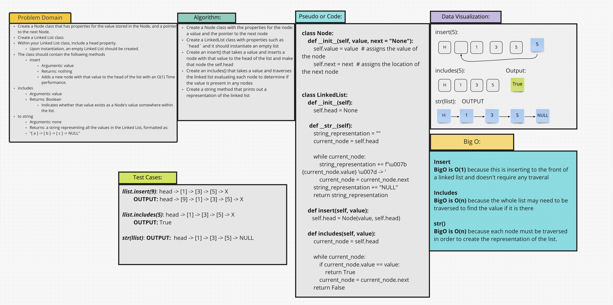

# Singly Linked List
A Linked List is a node-based data structure. It is a sequence of `Nodes` that are connected / linked to each other. The
most defining feature of a Linked List is that each `Node` references the next `Node` in the link.

## Challenge
The challenge was to create a Node class that has properties for the value stored in the Node, and a pointer to the next
Node. Then, create a Linked List class that includes a `head` property.

## Approach & Efficiency
* Create a Node
* Create a LinkedList class
  * Define methods for working with the LinkedList
    * `.insert()` - takes a value for an argument and inserts a Node with the new value at the `head` of the list.
    * `.includes()` - takes a value for an argument and returns a bool indicating whether the value is somewhere in the list.
    *  `str()` - takes no arguments but, returns a string representing all the values in the Linked List.

## API
[Code](/data_structures/linked_list.py)
* `.insert()`
* `.includes()`
* `str()`

