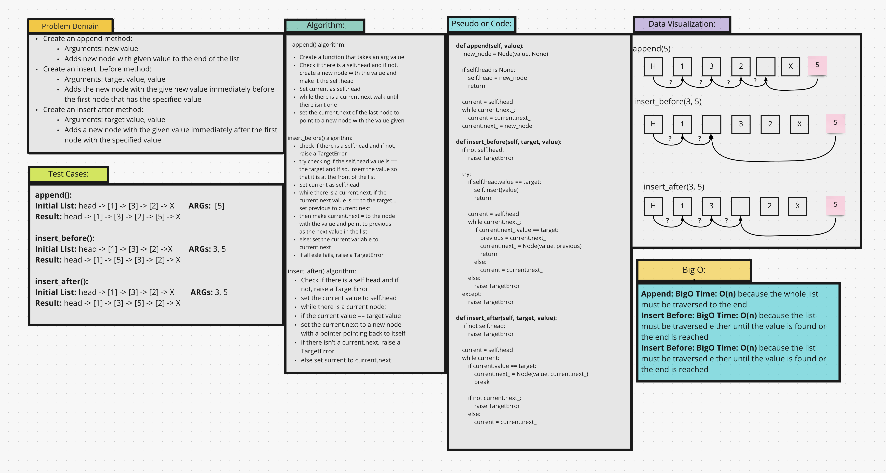

# Challenge Summary
This code challenge adds further functionality to the LinkedList class by the addition of new methods to alter
or work with a LinkedList

## Whiteboard Process

## Approach & Efficiency
I used the approach much like the one in class. Traversing the list until finding the correct place for insertion and
then, acting on it accordingly.

## Solution
Examples of use:
* `llist.append(5)` - will add 5 to the end of the list
* `llist.insert_before(3, 5)` - will insert a node with the value of 5 before the node with a value of 3, if found
* `llist.insert_after(3, 5)` - will insert a node with the value of 5 after the node with a value of 3, if found
