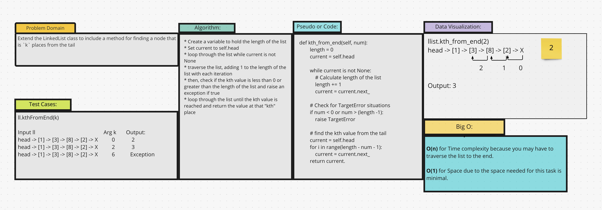

# Challenge Summary
Extend the LinkedList class and implement a method for returning the value located `k` places from the tail.

## Whiteboard Process

## Approach & Efficiency
My approach to solving this was to first find the length of the list. Weed out any values that would result in a
TargetError and then iterate over the list until the kth value is reached. Then, return the value located at that "index"

## Solution
[Code](/data_structures/linked_list.py)
* `llist.kth_from_end(2)` - will return the value located 2 nodes from the tail
* Input:
* head -> 1 -> 3 -> 5 -> Null
* Output:
* 3
