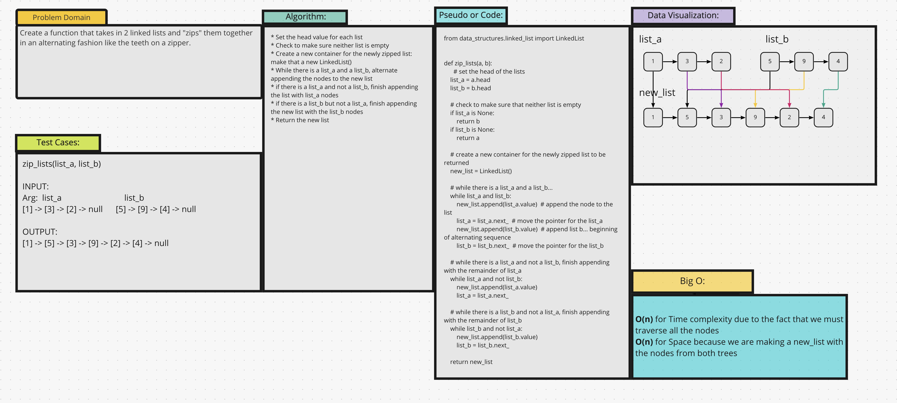

# Challenge Summary
This is an algorithm challenge wherein we are given 2 linked lists that must be "zipped" together in an alternating
fashion. We are allowed to use the previously built data structures for the class LinkedList and the class Node.

## Whiteboard Process

## Approach & Efficiency
I decided to approach this from the point of appending the values from 1 list and then the other list to the newly
created LinkedList. Should either list_a or list_b run short of the other... the algorithm will finish appending with
the remaining list.

## Solution
[Code](/code_challenges/linked_list_zip.py)
* `zip_lists(list1, list2)` - will return a new list with the values from each list alternating with the other like
zipper
teeth.

