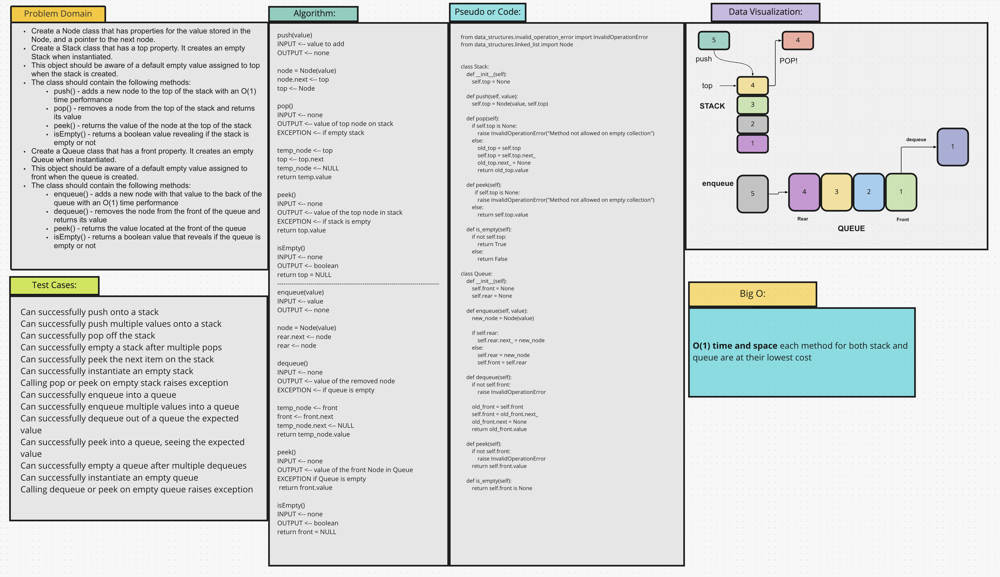

# Stacks and Queues
* Stacks store data much like arrays do but, with 3 different constraints:
  * Data can only be pushed onto the top of the stack
  * Data can only be deleted from the top of the stack
  * Only the top node of the stack can be read
* Queues are much like stacks but, with 3 different constraints;
  * Data can only be inserted at the end of the queue
  * Data can only be deleted from the front of the queue
  * Only the node at the front of the queue can be read

## Challenge
Implement a new data structure class and methods that work with stacks and queues

## Approach & Efficiency
I followed the examples in the class lecture and the notes provided on the data structures to implement these solutions.

## API
Stack APIs
* `push(value)` - pushes a new node onto the top of the stack with the value specified.
* `pop()` - removes the top node and returns the value
* `peek()` - returns the value at the top of the stack
* `is_empty()` - returns a boolean value to denote whether the stack is empty or not.

Queue APIs
* `enqueue(value)` - adds a new node with the specified value to the back of the queue
* `dequeue()` - removes a node from the front of the queue and returns its value
* `peek()` - returns the value of the node at the front of the queue
* `is_empty()` returns a boolean value indicating whether the queue is empty or not

