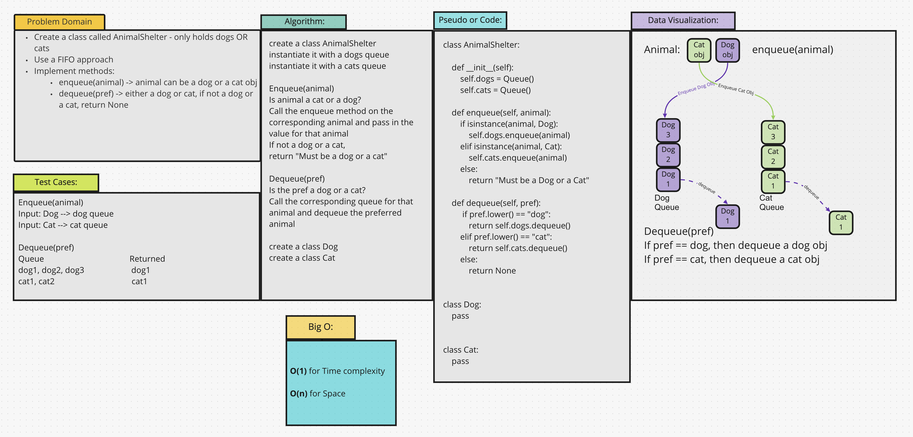

# Challenge Summary
Create a class called AnimalShelter which holds only dogs and cats. Using a FIFO approach, implement the enqueue and
dequeue methods according to the animal preferred.

## Whiteboard Process

## Approach & Efficiency
* Using a separate queue for dogs and one for cats makes retrieving according to preference easier.
* Create a queue for dogs and one for cats.
* Depending on a person's preference, return the cat or dog from the appropriate queue.
* The BigO for time O(1) and O(n) for space.

## Solution
[Code](/code_challenges/stack_queue_animal_shelter.py)
* `enqueue(animal)`: will add the dog or cat to the appropriate queue
* `dequeue(pref)`: will remove either a dog or a cat from the appropriate queue
