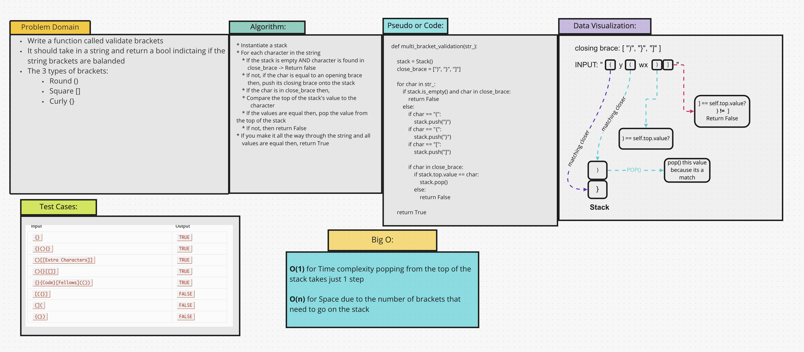

# Challenge Summary
Write a function to validate whether the brackets in a string are balanced. It should take in a string and return a
boolean indicating if the string brackets are balanced.

## Whiteboard Process


## Approach & Efficiency
[Code](/code_challenges/stack_queue_brackets.py)
* BigO for this function is O(n) for space and O(1) for time.
* Begin by checking if the stack is empty and if the character in question is a closing brace.
* If empty and a closing brace, return False
* If the char is an opening brace, push its corresponding character for closing brace to the stack
* If the character is a closing brace, compare it to the value at the top of the stack. If the char and value are
  equal, pop that value from the stack
* Else, if the character and value are not equal return False
* If all values have the correct corresponding brace, return True

## Solution

```text
Input	                                     Output
{ }	                                      TRUE
{ } ( ) { }	                              TRUE
( )[ [Extra Characters] ]	              TRUE
( ) { }  [ [ ] ]	                      TRUE
{ } { Code } [ Fellows ] ( ( ) )	      TRUE
[ ( { } ]	                              FALSE
( ] (	                                      FALSE
{ ( } )	                                      FALSE
```
