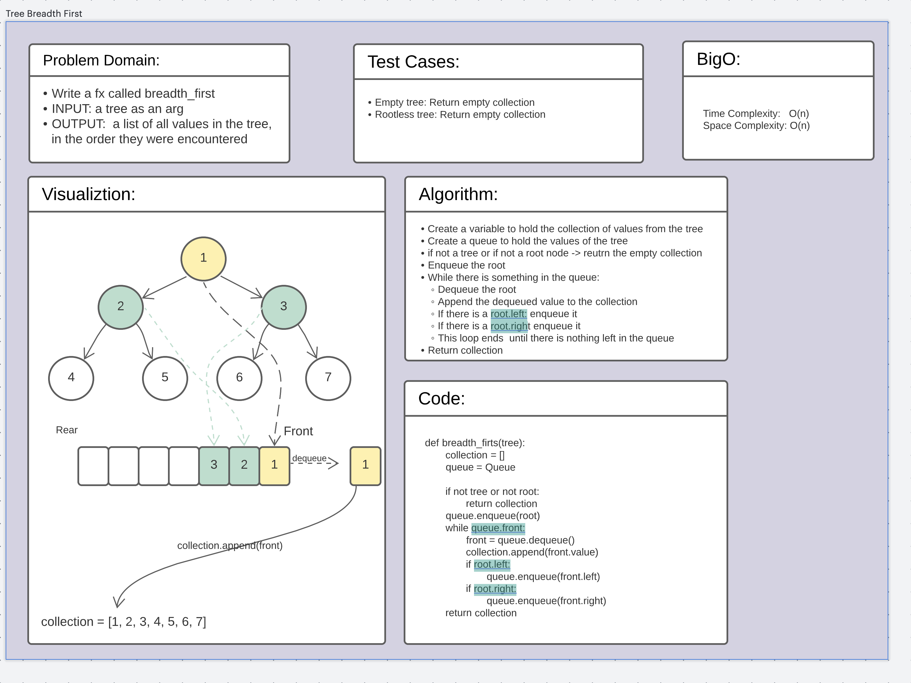

# Challenge Summary
Write a function called breadth_first(tree) that takes in a tree and lists all the values in the tree, in the order
they were encountered.

## Whiteboard Process

## Approach & Efficiency
[Code](/code_challenges/tree_breadth_first.py)
* BigO for Time and Space is O(n)
* Create a variable to hold the collection of values from the tree
* Create a queue to hold the values of the tree
* if not a tree or if not a root node -> reutrn the empty collection
* Enqueue the root
* While there is something in the queue:
  * Dequeue the root
  * Append the dequeued value to the collection
  * If there is a root.left: enqueue it
  * If there is a root.right enqueue it
  * This loop ends  until there is nothing left in the queue
* Return collection

