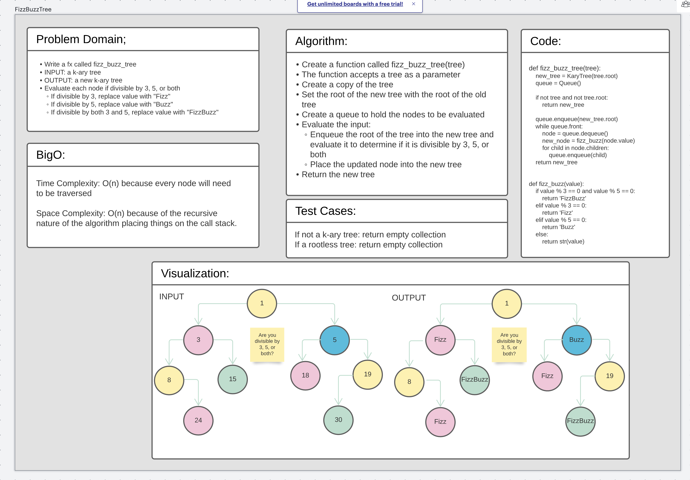

# Challenge Summary
Write a function called fizz_buzz_tree that takes in a tree and returns a new tree. The new tree will be a copy of
the old tree but, with the values of items divisible by 3, 5, or both update to "Fizz", "Buzz", or "FizzBuzz",
respectfully.

## Whiteboard Process

## Approach & Efficiency
* BigO for this is O(n) for both Time and Space.
* Make a copy of the tree
* Set the root of the original tree to the root of the new tree
* Create a queue to hold the nodes to be evaluated
* When a node is dequed from the queue, evaluate if it is cleanly divisible by 3, 5, or both and replace the value
  with "Fizz", "Buzz" or "FizzBuzz", respectfully.
  * Note: Division by both 3 and 5 must be the first evaluation
* Place the updated node into the new tree

## Solution
[Code](/code_challenges/tree_fizz_buzz.py)
* Please see whiteboard above for a visual of the solution output
