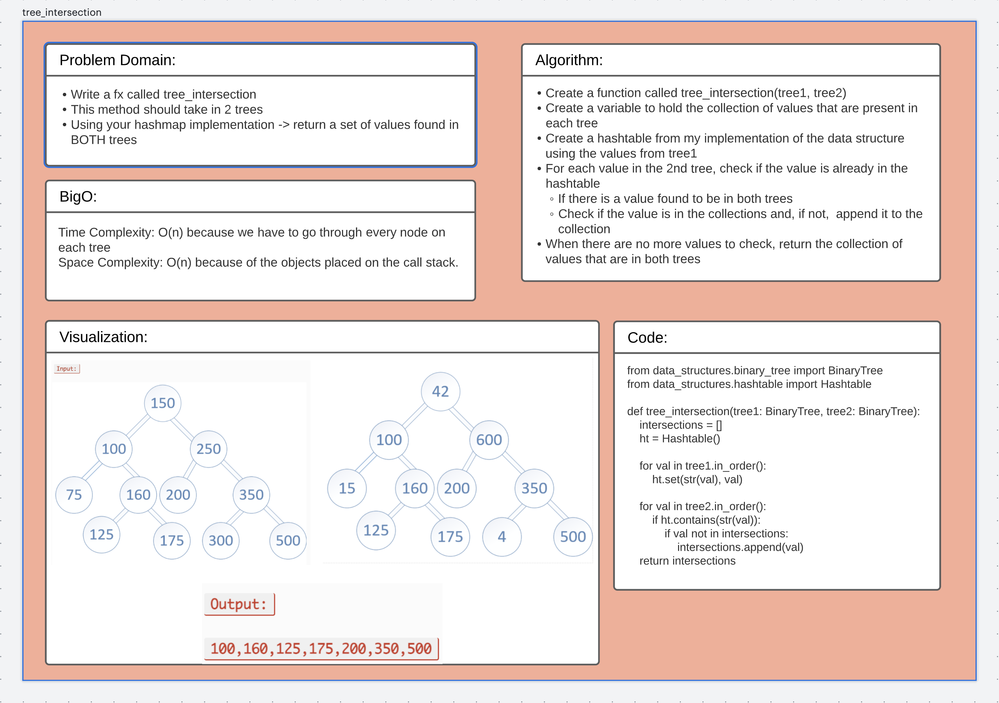

# Challenge Summary
Write a function that takes in 2 trees and returns the values found in both trees. Use your implementation of a
hashtable to make it happen.

## Whiteboard Process

## Approach & Efficiency
[Code](/code_challenges/tree_intersection.py)
* BigO for both Time and Space Complexity is O(n)
* Create a function called tree_intersection(tree1, tree2) that takes in 2 binary trees
* Create a variable to hold the collection of values found in both trees
* Create a hashtable from my implementation of the data structure
* Feed the values from tree1 into the hashtable
  * Check if the values found in tree2 match any of the keys in the hashtable using the .contains() method
  * If a value in tree2 is found to be in tree1, check to see if it is in the collection
    * If the value is found to not be in the collection, append it to the collection
* Return the collection of values
