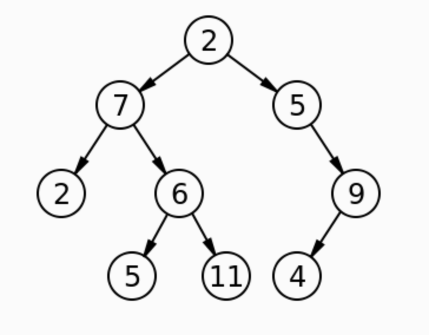

# Challenge Summary
Implement a function that can traverse a tree and return the max value in the tree.

## Whiteboard Process

## Approach & Efficiency
The approach is to set max_value to 0 and to sort the values using the in_order() and stuff the values into an array.
Then, loop through the array with a `for` loop comparing each number to the max_value. If a number is higher than the
current max_value then, set max_value to equal the new number. Return the max_value once the loop is complete.

## Solution
To run the code, just call the method on a tree:
`tree.find_maximum_value()`

Calling the method on this particular tree will return: 11

### Contributors
Shout out to Dwight Lindquist! His code reminded me that there was no reason to re-invent the wheel and to use what was
at my disposal!! Thank you, Dwight!
