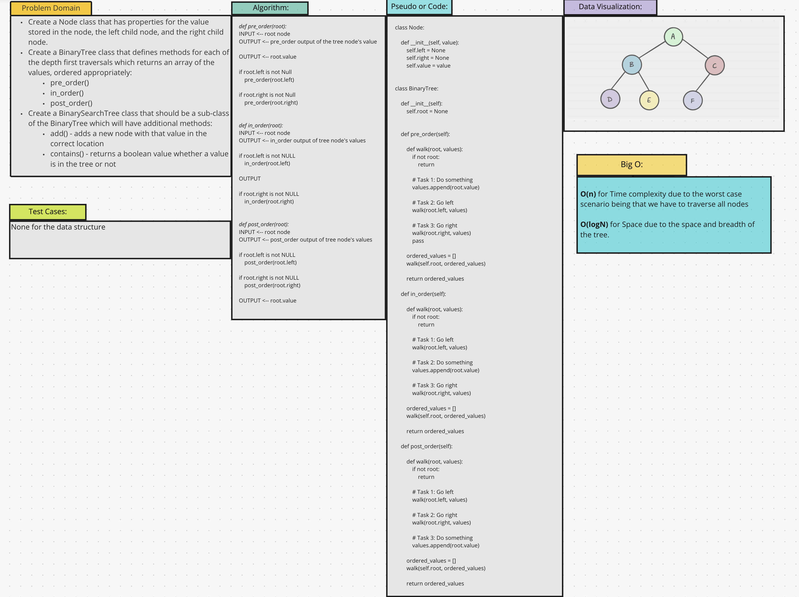
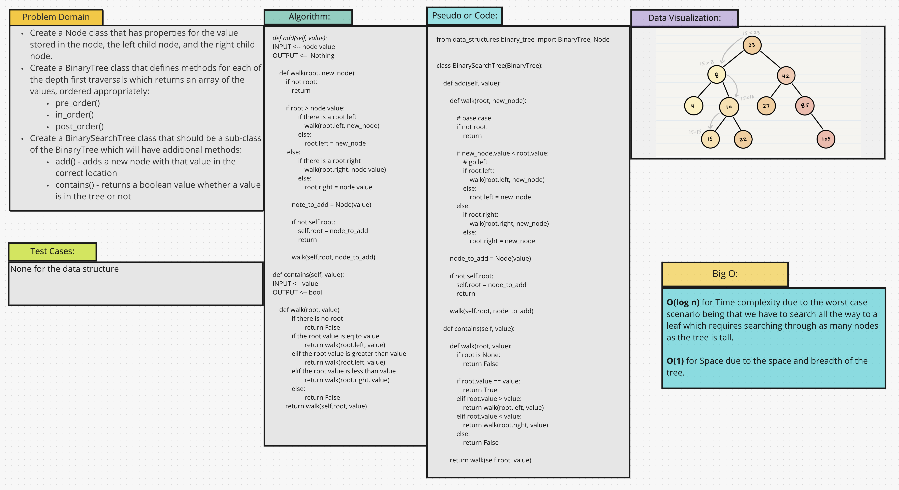

# Trees
* Trees are a node-based data structure that maintains order yet, provides a fast search, insertion, and deletion.
* A Binary Search Tree is a tree-based data structure that adheres to certain rules:
  * Each node can have only 1 left and 1 right child.
  * The left child should contain values that are less than the node itself.
  * The right child should contain values that are higher than the node itself.

## Challenge
* This is a newly implemented data structure.
* The challenge is to build the class with the appropriate methods to achieve the needs of that particular tree structure.

## Approach & Efficiency
* Create a Binary Tree class
* Define a method for each of the depth traversals:
  * `.pre_order()`
  * `.in_order()`
  * `.post_order()`

* Create a Binary Search Tree class that is the sub-class of the Binary Tree class that was just written.
* Define a method that:
  * `.add() `
  * `.contains()`

* Structure & Testing:
  * Utilize the single responsibility principle.
  * Can successfully instantiate an empty tree.
  * Can successfully instantiate a tree with a single root node.
  * For a Binary Search Tree, can successfully add a left child and a right child properly to a node.
  * Can successfully return a collection from a `pre_order` traversal.
  * Can successfully return a collection from an `in_order` traversal.
  * Can successfully return a collection from a `post_order` traversal.
  * Returns `True` or `False` for the `.contains()` method, given an existing or non-existing node value.
## API
[Binary Tree Code](/data_structures/binary_tree.py)
* For the Binary Tree:
  * `.pre_order()`
  * `.in_order()`
  * `.post_order()`

[Binary Search Tree Code](/data_structures/binary_search_tree.py)
* For the Binary Search Tree:
* Since the binary search tree extends the binary tree, it inherits the above APIs in addition to:
  * `.add()`
  * `.contains()`

